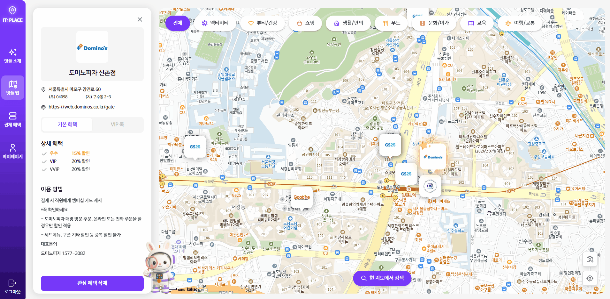
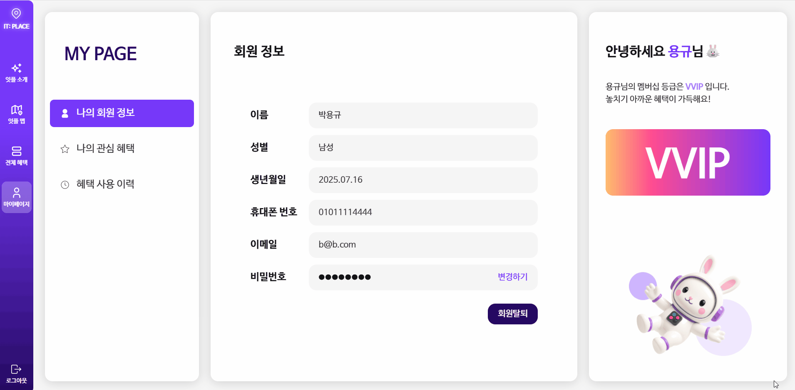

# It Place: 잇플레이스

> LG U+ 유레카 2기 최종 융합프로젝트 6팀 (2025.06.30 ~ 08.07)  
> 사람과 혜택을 잇는 장소 – 통신사 멤버십 혜택을 쉽고 스마트하게 탐색하는 지도 기반 플랫폼

 

## 🔗 팀 협업 및 배포 링크

> 프로젝트와 관련된 협업 문서, 디자인 시안, 배포된 서비스는 아래 링크를 통해 확인할 수 있습니다.

  
  
  
  

- **📒 팀 Notion**: 프로젝트 기획안, 회의, 일정 등 모든 협업 기록 문서가 정리되어 있는 공간입니다.
- **🎨 팀 Figma**: It Place의 와이어프레임, 디자인 시안, 프로토타입이 정리되어 있습니다.
- **🚀 메인 서비스**: 실제 사용자들이 이용할 수 있는 It Place의 배포된 웹사이트입니다.
- **🛠 관리자 페이지**: 제휴처 정보, 사용자 통계 등 관리자 기능을 사용할 수 있는 전용 페이지입니다.

 

## 🐰서비스 소개

> **It Place: 잇플레이스**는 LG U+ 멤버십 이용자들이 전국 제휴처를 **지도 기반**으로 탐색하고, 혜택을 **간편하게 확인**하며, **개인 맞춤형 혜택 추천**을 받을 수 있는 지도 기반 혜택 안내 플랫폼입니다.  
> 지도, 위치, 혜택, 데이터를 유기적으로 연결하여 "잇다(Connect)"는 가치를 실현합니다.

- **It**: 지금 가장 주목받는, ‘핫한’ 장소
- **Place**: 실제 제휴처 위치
- **잇다 + 플레이스**: 사람과 혜택, 제휴처를 잇는 스마트한 공간

 

## 👍🏻기획 배경 & 목적

- **문제**: 많은 사용자가 통신사 멤버십 혜택을 놓치고 있음
- **해결**: 위치 기반 지도 탐색 + AI 추천 시스템으로 혜택 접근성 향상
- **효과**: 사용자는 더 쉽게 혜택을 누리고, 기업은 더 나은 마케팅 지원 가능

 

## ⭐주요 기능
> 유플러스 회원정보 연동 기능의 경우, 실제 데이터를 가져올 수는 없어 mockData로 유플러스 회원 DB에 있는 회원만 가능한 기능입니다.

### 1️⃣ 회원가입 & 로그인

- 일반 회원가입 및 소셜 로그인 지원
- LG U+ 멤버십 연동 시 기본 정보 자동 불러오기
- 번호 인증, 이메일 인증, reCAPTCHA를 통한 보안 강화
- 개인정보 수정 및 회원 탈퇴 기능 제공

### 2️⃣ 지도 및 위치 기반 시스템

- Kakao Map API를 활용한 제휴처 마커 표시
- 로드뷰 지원으로 실제 위치 확인 가능
- GPS 기반 현재 위치 탐색 및 반경 내 검색
- 거리순 정렬, 카테고리별 필터링 기능
- 사용자 데이터를 활용한 AI 기반 혜택 추천
- 사용자 지정 위치로 재검색 가능
- 혜택 사용 버튼 및 거리 제한 조건으로 무분별한 사용 방지
- 제휴처 홈페이지 외부 링크 이동 기능 지원

### 3️⃣ 혜택 및 제휴처 정보 제공

- 제휴처 위치 및 혜택에 대한 상세 정보 제공
- 멤버십 등급별 혜택 정보 표시
- 즐겨찾기 기능으로 원하는 혜택 저장
- 사용자 검색 로그 기록 저장
- 혜택 사용 이력 및 누적 혜택 금액 조회 가능
- 제휴처 홈페이지 리다이렉트 기능 제공

### 4️⃣ AI 추천 & 질문 서비스

- 멤버십 혜택 이력 & 사용자 행동 로그를 반영한 개인 맞춤 추천
- 사용자 질문 의도에 맞는 AI 제휴처 정보 제공
- 금칙어 필터링
- 로그를 활용한 추천 콜드 스타트 완화

### 5️⃣ 관리자 대시보드 & 통계 관리

- 직관적인 대시보드로 서비스 현황 Overview 제공
- 제휴처별: 이용 통계, 관심도 통계, 클릭 수 통계, 검색 순위 통계
- 멤버십 등급별 사용자 수 및 혜택 사용률 확인
- 제휴처 정보 조회 및 수정 기능
- 회원 정보 조회 기능 지원

### 5️⃣ 이벤트 페이지 & 프로모션 기능

- 지도 내 이벤트 지점을 통한 혜택 사용 유도
- 스크래치 카드 기반 이벤트 기능 제공
- 로그인 여부 및 보유 쿠폰 수에 따라 긁기 제한 제어

 

## 🎥데모 & 미리보기

> 🔽 주요 기능 시연 GIF 및 스크린샷

| 기능                 | 미리보기               |
| -------------------- | ---------------------- |
| 지도기반 제휴처 탐색 |     |
| 혜택상세             |  |
| 마이페이지           |  |
| 관리자 대시보드      |   |
| 이벤트 |     |
| 모바일 전용 레이아웃 |  |

 

## 🛠기술 스택

#### 🖥️ 프론트엔드

  
  
  
  
  
  
  
  
  
  
  

#### 🔧 백엔드

 

#### ⚙️ 인프라

#### 💬 커뮤니케이션 & 협업

  
  
  
  
  
  

 

## 🧑‍🤝‍🧑멤버

| 이름      | 담당 역할                       | GitHub                                                                                                                                          |
| --------- | ------------------------------- | ----------------------------------------------------------------------------------------------------------------------------------------------- |
| 👨‍💻 최영준(프론트) | 디자인 설계, 전체 혜택 페이지, 관리자 페이지 |             |
| 👨‍💻 박용규(프론트) | 디자인 설계, 로그인 페이지, 메인 페이지 |           |
| 👨‍💻 백세진(프론트) | 디자인 설계, 랜딩 페이지, 이벤트 컴포넌트 |           |
| 👨‍💻 염승아(프론트) | 디자인 설계, 마이 페이지, 이벤트 페이지 |        |
| 👨‍💻 이희용(백엔드) | 인증&인가, 인프라, 지도 구축 |  |
| 👩‍💻 정현경(백엔드) | 제휴처 시스템, 이벤트 기능, 관리자 페이지 |                 |
| 👩‍💻 하령경(백엔드) | 로그 저장, 관리자 대시보드, 지도 서비스 |               |
| 👨‍💻 허승현(백엔드) | AI 추천 시스템, 즐겨찾기, 벡터DB 관리 |                |
